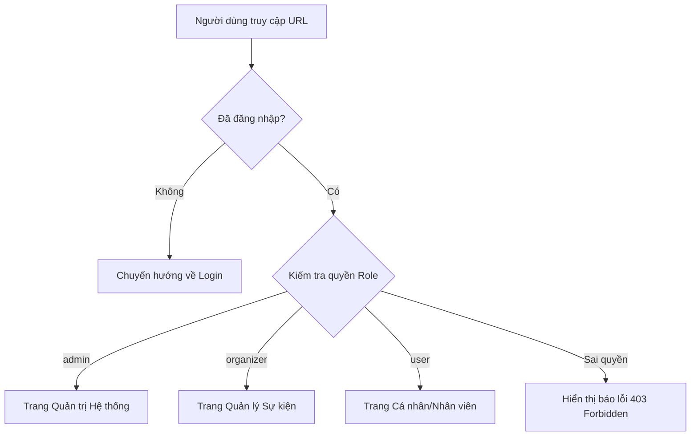

# 07. Thuật toán & Cơ chế bảo mật (Algorithms)

Hệ thống áp dụng các tiêu chuẩn bảo mật hiện đại để bảo vệ dữ liệu người dùng và tính toàn vẹn của ứng dụng.

## 1. Thuật toán Băm mật khẩu (Bcrypt Hashing)
Hệ thống KHÔNG lưu trữ mật khẩu ở dạng văn bản thuần túy (plain text).
- **Cơ chế**: Sử dụng thuật toán `Blowfish` với thông số `Salt Rounds = 10`.
- **An toàn**: Mỗi mật khẩu khi băm sẽ ra một chuỗi khác nhau kể cả khi mật khẩu giống nhau (nhờ Salt). Điều này giúp chống lại tấn công Brute Force và Rainbow Table.
- **Thực thi**:
  ```javascript
  const hashed = await bcrypt.hash(plainPassword, 10);
  ```

## 2. Xác thực Stateless (JSON Web Token)
Thay vì dùng Session truyền thống, hệ thống dùng mã JWT để quản lý phiên đăng nhập.
- **Cấu trúc**:
    - **Header**: Khai báo loại token và thuật toán (HS256).
    - **Payload**: Chứa thông tin public của người dùng (`id`, `name`, `role`, `email`).
    - **Signature**: Chữ ký được tạo từ Header, Payload và **JWT_SECRET** để đảm bảo token không bị giả mạo.
- **Thời hạn**: Token mặc định có hiệu lực trong **2 giờ**.

## 3. Đối chiếu JWT giữa Lý thuyết và Thực tế Code
Để giúp hiểu rõ cơ chế bảo mật, dưới đây là bảng đối chiếu các khái niệm JWT với các file mã nguồn cụ thể trong dự án:

### Tại Backend (Máy chủ)
| Chức năng | Vị trí File | Hàm/Đoạn code xử lý |
| :--- | :--- | :--- |
| **Tạo JWT** (Sau khi Login) | `server/services/authService.js` | `jwt.sign({ id, email, role, name }, ...)` |
| **Xác minh JWT** (Khi gọi API) | `server/middlewares/authMiddleware.js` | `jwt.verify(token, JWT_SECRET)` |
| **Cấu hình Secret Key** | `server/.env` | Biến `JWT_SECRET` (Mã bí mật để ký tên) |

### Tại Frontend (Giao diện)
| Chức năng | Vị trí File | Cách thức hoạt động |
| :--- | :--- | :--- |
| **Lưu trữ Token** | `frontend/src/pages/Login.jsx` | Lưu vào `localStorage.setItem('token', ...)` |
| **Tự động gửi Token** | `frontend/src/services/api.js` | **Request Interceptor**: Tự gắn vào Header `Authorization`. |
| **Đọc thông tin (Payload)** | `frontend/src/context/AuthContext.jsx` | Hàm `decodeToken` dùng `atob` để lấy tên và vai trò. |
| **Xử lý Token hết hạn** | `frontend/src/services/api.js` | **Response Interceptor**: Nhận lỗi 401 và đẩy về trang Login. |

## 5. Phân quyền thông minh (Smart Routing)

Hệ thống sử dụng cơ chế bảo vệ Route đa tầng ở Frontend để đảm bảo người dùng chỉ truy cập được các trang trong phạm vi quyền hạn của mình.

### Cơ chế hoạt động:
1.  **ProtectedRoute**: Kiểm tra xem người dùng đã đăng nhập chưa (có Token không). Nếu chưa, tự động đẩy về trang chủ/login.
2.  **RoleRoute**: Kiểm tra hằng số `user.role` từ `AuthContext`.
    -   Nếu là `admin` → Truy cập `/admin/*`.
    -   Nếu là `organizer` → Truy cập `/dashboard/*`.
    -   Nếu là `user` (Nhân viên) → Truy cập `/my-portal/*`.

### Sơ đồ Logic phân quyền:



### Triển khai trong mã nguồn:
- **Frontend**: File `frontend/src/App.jsx` định nghĩa các Component `ProtectedRoute` và `RoleRoute` bao bọc các Route nhạy cảm.
- **Backend**: Middleware `authorize(['admin', 'organizer'])` kiểm tra trực tiếp Role trong Token trước khi xử lý DB.
