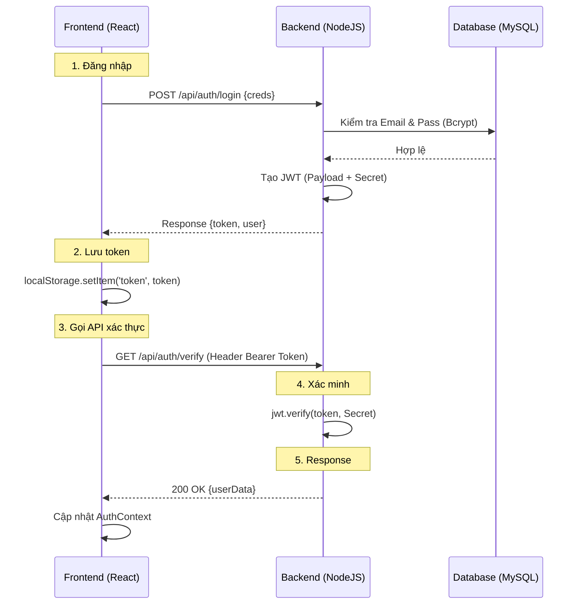

# BIỂU MẪU 01: THIẾT KẾ LUỒNG XÁC THỰC NGƯỜI DÙNG

**Tên dự án:** EventPro Management System  
**Nhóm:** [Tên nhóm]  
**Người thực hiện:** Nguyễn Như Ý

---

## 1. THÔNG TIN API XÁC THỰC

| Endpoint | Method | Mô tả | Request Body | Response |
|:---|:---:|:---|:---|:---|
| `/api/auth/register` | POST | Đăng ký tài khoản mới | `{name, email, password}` | `201 Created` |
| `/api/auth/login` | POST | Đăng nhập hệ thống | `{email, password}` | `200 OK + JWT Token` |
| `/api/auth/verify` | GET | Lấy thông tin người dùng | (Header: Authorization) | `User Profile Info` |
| `/api/auth/reset-password`| PUT | Đổi mật khẩu | `{oldPass, newPass}` | `Success message` |
| `/api/auth/seed` | POST | Khởi tạo tài khoản Admin | (None) | `Admin credentials` |

## 2. CẤU TRÚC TOKEN JWT

- **Payload chứa:** [x] userId | [x] email | [x] hoTen | [x] vaiTro | [ ] Khác: ________
- **Thời hạn token:** [ ] 1 ngày | [ ] 7 ngày | [ ] 30 ngày | [x] Khác: 2 giờ
- **Lưu trữ token:** [x] localStorage | [ ] sessionStorage | [ ] Cookie | [ ] Khác: ________

## 3. PHÂN QUYỀN NGƯỜI DÙNG

| Vai trò | Quyền hạn | Trang được truy cập |
|:---|:---|:---|
| **Admin** | Toàn quyền hệ thống, quản lý tài khoản người dùng | Toàn bộ hệ thống, `/admin/users` |
| **Organizer** | Quản lý sự kiện, khách mời, nhân sự, ngân sách | `/dashboard`, `/events`, `/guests`, `/staff`, `/budget` |
| **User** | Đăng ký tham gia, xem lịch, nhận vé QR cá nhân | `/my-portal`, `/calendar`, `/profile`, `/events/:id` |
| **Khách (chưa login)**| Xem thông tin sự kiện công khai | Trang chủ, `/guest-portal` |

## 4. SƠ ĐỒ LUỒNG XÁC THỰC
*(Đăng nhập → Lưu token → Gọi API → Xác minh → Response)*

